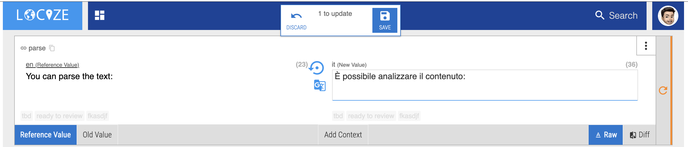
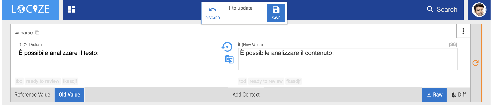
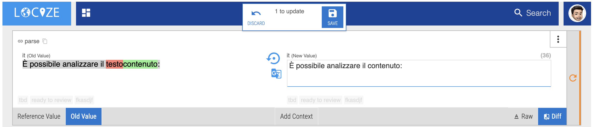

# How do the buttons in the editor work?

In general on the left side is the value of the reference language and on the right side the target language.

So when you're working on a segment *(before pushing the save button)* it should look like this:

To see what the segment value in the target language looked like before the change you can click on the "Old Value" button (left side). Now on the left side *(where usually is the reference language)* you can see the value of the target language before you changed it.

To have a detail view on what exactly changed. You can click on the "Diff" button (right side).
Now you can see what actually has changed.

green was added 
red was removed

*This is the default view when importing a file directly in the editor.*

<h2>And what is  doing?</h2>

This button will reset the segment to its old value.
This could be helpful when you're importing a file and want to confirm everything but a few segments.
