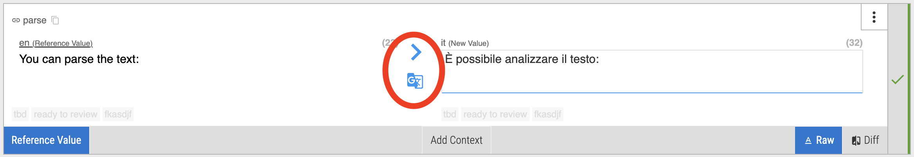

# What is the difference of the buttons between the segments in the editor?

 The arrow just copies the value of the reference language (left side). This is useful i.e. when working on a region specific language. For example reference language (left side) is <b>en</b> and target language (right side) is <b>en-GB</b>.

 The google translate button will simply try to translate the value of the reference language (left side) to the target language (right side) with the help of the google translate service.
